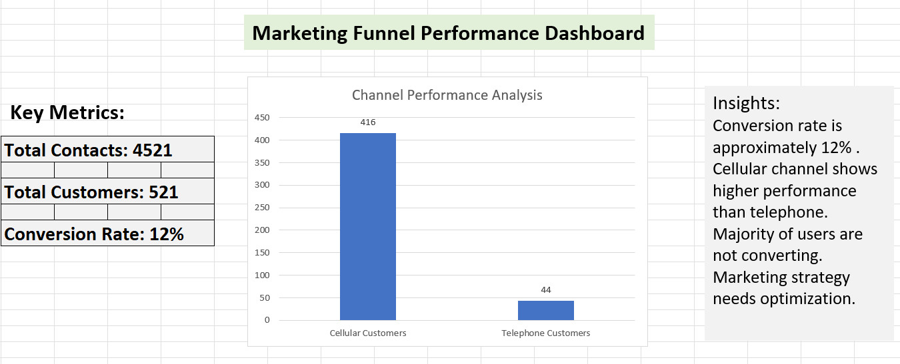

# Marketing Funnel Analysis using Excel

This project analyzes marketing funnel data to evaluate customer conversion and channel performance.

## Dashboard
An interactive Excel dashboard was created to visualize key metrics, channel performance, and insights.

## Key Metrics
- Total Contacts: 4521  
- Total Customers: 521  
- Conversion Rate: 12%

## Insights
- Conversion rate is relatively low (~12%)  
- Cellular channel performs significantly better than telephone  
- Majority of users are not converting  
- Indicates need for marketing strategy optimization  

## Tools Used
- Microsoft Excel  

## Outcome
Identified performance gaps and built a dashboard to present insights effectively for better decision-making.
